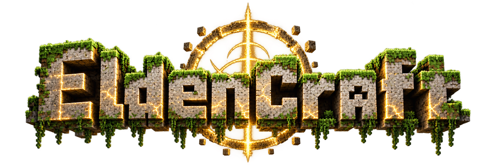
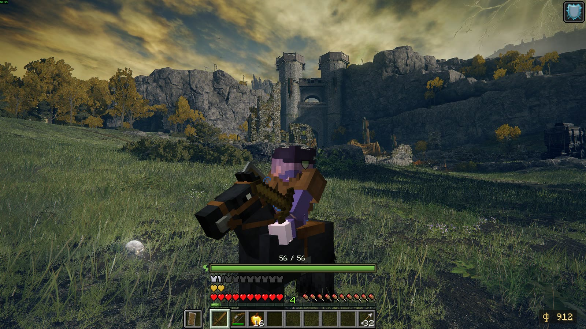
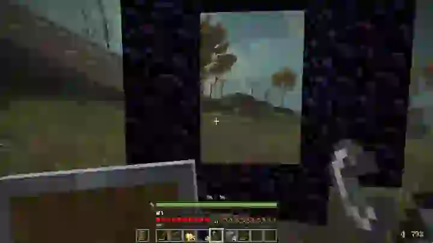
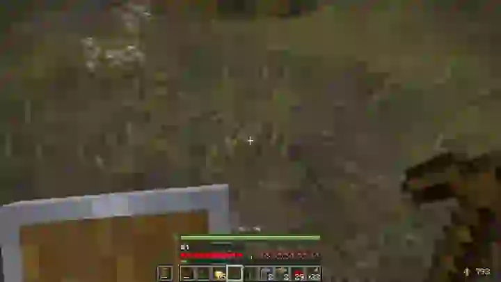
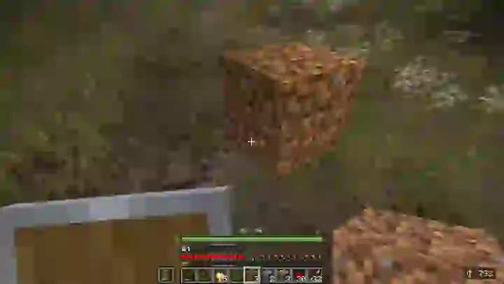
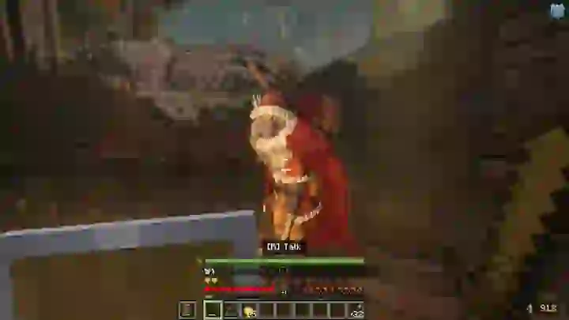
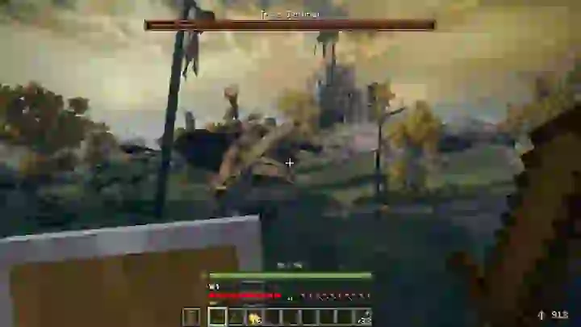
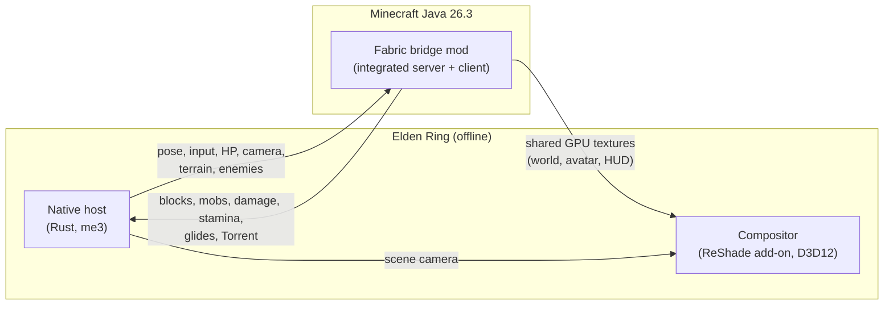

<p align="center">
  
</p>

<h3 align="center">Minecraft in the Lands Between.</h3>

<p align="center">
  <em>Now with an actual progression!</em>
</p>

<p align="center">
  <a href="../../releases/latest"></a>
  <a href="https://discord.gg/7qDyAzAq9"></a>
</p>

<p align="center">
  
  
  
  <a href="LICENSE"></a>
</p>

<p align="center">
  
</p>

> [!WARNING]
> **EldenCraft is in early alpha and nowhere near finished.** Expect bugs, rough
> edges, missing features, unbalanced progression and the occasional crash. Saves
> are backed up before every launch, but keep your own copies of anything you
> care about. Bug reports are very welcome!

**EldenCraft runs Minecraft Java Edition _inside_ Elden Ring.** Both games run
at once. Elden Ring brings the world, the enemies, the bosses and the collision.
Minecraft brings the blocks, the inventory, the tools, the HUD and the arm
swinging that wooden pickaxe. The two renderers are composited into a single
frame, so the Tree Sentinel is about to meet a man in leather armour holding a
stack of cobblestone.

No asset rips, no recreations: these are the **real games**, talking to each other.

We also took a novel approach to modelling the world, which means no janky collisions anymore!

---

## Feature showcase

<table>
  <tr>
    <td width="50%" valign="top">
      <a href="https://imgur.com/a/etWOkaH"></a>
      <h3>🔥 The Nether comes to Elden Ring</h3>
      <p>Build an obsidian frame, light it, and step through. The Lands Between
      burn: a crimson sky, netherrack rolling over Elden Ring's own hills, fire,
      lava and ghasts drifting above the Erdtree. Survive the waves and walk
      back out.</p>
    </td>
    <td width="50%" valign="top">
      <a href="https://imgur.com/a/OC60jRV"></a>
      <h3>⛏️ Mine the Lands Between</h3>
      <p>Elden Ring's terrain is minable. Grass gives dirt, boulders give stone,
      and each native surface maps to a real Minecraft material. Hold left
      click and watch Limgrave crack.</p>
    </td>
  </tr>
  <tr>
    <td width="50%" valign="top">
      <a href="https://imgur.com/a/sB3n8kx"></a>
      <h3>🧱 Build it, wire it</h3>
      <p>Everything you dig is a real block you can place back, with real
      collision in Elden Ring. Raise walls across Limgrave, lay redstone dust
      and fire pistons next to the ruins. Crafting tables included.</p>
    </td>
    <td width="50%" valign="top">
      <a href="https://imgur.com/a/eMdF0NL"></a>
      <h3>💰 Runes buy diamonds</h3>
      <p>Talk to Kalé and get a Minecraft dialog. Open his shop and spend your
      <em>actual</em> Elden Ring runes on swords, food, armour and building
      blocks. Purchases are journaled across both saves, so a purchase cut off
      by a crash is recovered instead of charged twice.</p>
    </td>
  </tr>
  <tr>
    <td width="50%" valign="top">
      <a href="https://imgur.com/a/1bzQ0BH"></a>
      <h3>🛡️ Stamina-based combat</h3>
      <p>Yes, that's the Tree Sentinel, and yes, that's a wooden sword. Every
      swing and every shield block draws from a Minecraft stamina bar, so get
      greedy and you'll be out of breath when the halberd comes down. Native
      boss health shows up as a Minecraft boss bar, and remembrance victories
      raise your health and stamina caps.</p>
    </td>
    <td width="50%" valign="top">
      <a href="https://imgur.com/a/UCBH7mf"></a>
      <h3>🐎 Torrent, now in voxels</h3>
      <p>Press <kbd>Y</kbd> and the spectral steed answers as a saddled black
      Minecraft horse. Gallop at 11 m/s, dash at 16, and double jump over
      anything in your way. <a href="#torrent">More below</a>.</p>
    </td>
  </tr>
</table>

<p align="center"><sub>Click any clip to watch the full video.</sub></p>

## Everything else

| | |
| --- | --- |
| **Progression** | From wood to netherite across **159** boss rewards. Every remembrance is a milestone. |
| **Arsenal** | Swords, shields, bows, crossbows, TNT, ender pearls, elytra, golden and enchanted golden apples, and totems of undying: all real Minecraft items. A totem in either hand cheats death from an Elden Ring blow too, and its absorption hearts soak up the next hits. |
| **Enemy drops** | Ordinary enemies drop bread, arrows, crafting junk and the occasional golden apple where they fall; better food joins as you climb the material tiers. Boss rewards go straight to your inventory. |
| **Boss bars** | Native boss health in Minecraft boss bars, with the yellow damage trail. |
| **Minecraftified menus** | Sites of Grace, NPC conversations and confirmations become Minecraft screens; the original quest scripts still decide the outcome. |
| **Map and fast travel** | Elden Ring's own map on <kbd>M</kbd> or <kbd>G</kbd>, with the Minecraft overlay out of the way so it is fully clickable. |
| **Ender Chest at every grace** | Sort chest becomes your persistent Ender Chest. |
| **Weather sync** | When it rains or storms in the Lands Between, it rains or thunders in Minecraft too. |
| **First or third person** | <kbd>F5</kbd> works the way your muscle memory expects. |
| **Shared GPU composition** | Both renderers merge through shared GPU textures with depth-aware composition. |
| **Save safety** | A dedicated Minecraft world and Elden Ring save, verified ZIP backups before every change. |

## Torrent

Press <kbd>Y</kbd> on solid ground to whistle. The whistle follows Elden Ring's rules: it
works in the open world and the underground, but not in legacy dungeons,
catacombs, caves or other enclosed areas. Riding into one of those areas, or
opening a grace or NPC menu, dismisses Torrent. Press <kbd>Y</kbd> again on the
ground to dismount.

- **Gallop** with WASD at about 11 m/s; hold <kbd>Ctrl</kbd> to **dash** at about 16 m/s in any direction.
- **Jump** with <kbd>Space</kbd>, then press it again in the air to **double jump** and steer toward the held direction.
- Crouching and a raised shield don't slow him, and hits don't knock him back.
- The camera rises to saddle height, and hoofbeats replace your footsteps.

Native attacks land on the rider, and Torrent loses the same share of his health
as you do. He recovers slowly while dismissed. If his health runs out you are
thrown off, and calling him back costs **3 shanks of food** (free in creative).
He can't open an elytra glide and is never saved with the world.

## Quick start

> [!IMPORTANT]
> You need **owned copies of both games**: Elden Ring on Steam (executable **2.7.1.0**)
> and Minecraft **Java Edition**. EldenCraft is **offline singleplayer only** (Seamless Coop might be added in the near future though!).
> Online Elden Ring and Minecraft LAN/server sessions turn the bridge off.

1. Download **`EldenCraft-<version>-windows-x64.zip`** from the [latest release](../../releases/latest) and extract the entire ZIP to an ordinary writable local folder, such as `C:\Games\EldenCraft`. Keep `scripts`, `config` and `payload` beside `EldenCraft.cmd`.
2. Sign in to Steam and close both games.
3. Double-click **`EldenCraft.cmd`**.
4. On first launch, sign in with your Microsoft account in Prism Launcher, then close the launcher to continue.
5. Minecraft creates and joins its dedicated **EldenCraft** world automatically. Load or create an Elden Ring character, and the two games connect.

The dedicated offline Minecraft player is protected while the bridge is waiting
for Elden Ring, loading a map or disconnected. Natural mobs do not spawn in the
staging world, and existing staging hostiles are removed. Spawn eggs and the
shared Nether's waves keep their normal behavior.

The same script handles setup and every later launch. It downloads checksum-verified,
portable Java, Prism Launcher, me3 and ReShade, installs the bridge and starts both
games. **No Python, Rust, Gradle, Visual Studio or system Java needed.**

<details>
<summary><b>Launcher options</b></summary>

The launcher finds your Steam libraries. If it can't find Elden Ring, it opens a
file picker, or you can pass the path:

```powershell
.\EldenCraft.cmd -GamePath "D:\SteamLibrary\steamapps\common\ELDEN RING\Game\eldenring.exe"
```

```powershell
.\EldenCraft.cmd setup       # Install and configure without starting the games
.\EldenCraft.cmd check       # Verify release files and game compatibility
.\EldenCraft.cmd -CpuFrames  # Use shared-memory frames instead of GPU sharing
```

</details>

### System requirements

| Component | Supported configuration |
| --- | --- |
| Windows | Windows 10/11 x64, build 19041 or newer |
| Elden Ring | Owned Steam installation, executable product version **2.7.1.0** |
| Minecraft | Owned **Java Edition** account; the launcher installs **26.3** |
| Graphics | DirectX 12 for Elden Ring, OpenGL for Minecraft; SDR output |
| Resources | Enough memory and GPU headroom to run both games at once |

## Controls

| Key | Action |
| --- | --- |
| <kbd>W</kbd> <kbd>A</kbd> <kbd>S</kbd> <kbd>D</kbd> | Move and strafe |
| <kbd>Ctrl</kbd> / <kbd>Shift</kbd> / <kbd>Space</kbd> | Sprint / sneak / jump |
| <kbd>Left mouse</kbd> | Attack; hold to mine |
| <kbd>Right mouse</kbd> | Use an item, place a block, or charge a ranged weapon |
| <kbd>Y</kbd> | Summon or dismiss **Torrent** |
| <kbd>R</kbd> | Elden Ring interaction: ladders, doors, items, levers and Sites of Grace |
| <kbd>E</kbd> | Minecraft inventory |
| <kbd>M</kbd> / <kbd>G</kbd> | Elden Ring map (Minecraft is hidden until it closes) |
| <kbd>T</kbd> / <kbd>/</kbd> | Chat / command |
| <kbd>1</kbd>–<kbd>9</kbd> / wheel | Hotbar selection |
| <kbd>Q</kbd> / <kbd>F</kbd> | Drop item / swap offhand |
| <kbd>Escape</kbd> | Minecraft pause menu |
| <kbd>F5</kbd> | First person / rear third person / front third person |
| <kbd>F6</kbd> | Toggle Minecraft composition |
| <kbd>F4</kbd> | Toggle combat hitbox diagnostics |
| <kbd>F11</kbd> | Toggle the ReShade compositor |

<details>
<summary><b>Menus and the map</b></summary>

- In menus: <kbd>Enter</kbd> / <kbd>R</kbd> confirms; <kbd>Up</kbd> / <kbd>Down</kbd>, <kbd>W</kbd> / <kbd>S</kbd> or <kbd>Tab</kbd> navigate; <kbd>Escape</kbd> / <kbd>E</kbd> closes. Camera and gameplay controls stay locked while a menu is open.
- The map is Elden Ring's own, with its normal mouse controls and fast travel. Close it with <kbd>M</kbd>, <kbd>G</kbd> or <kbd>Escape</kbd>; Minecraft comes back once the key is released.
- Merchants offer a single **Shop** row that opens the Minecraft shop; native selling is not offered.
- Grace menus drop level-up, flask and memorize-spell rows; Sort chest opens your Ender Chest. Specialist screens such as equipment and Great Runes keep their native interface for now.
- Signs: place one and type its text directly; Escape or **Done** saves it.
- The Minecraft world keeps running when you switch windows. Its pause menu closes when you switch away; inventory and chat stay open.

</details>

## How it works



Minecraft's integrated server owns items, inventory, blocks, mobs and vanilla
rules. Elden Ring owns movement, collision and your HP. A native movement model
reproduces vanilla walking, sprinting, jumping, elytra and Torrent at Elden
Ring's physics stage, so the controls feel like Minecraft but native collision
still decides where you can go. Every channel is a bounded, versioned local
mapping with session identity and freshness checks; no game pointers ever cross
the process boundary. The full contract is in [PROTOCOL.md](PROTOCOL.md).

Use **R** to enter an Elden Ring ladder, then **W/S** to climb up or down with
the native ladder controls. Minecraft ladders use vanilla climbing: press into
the ladder or hold **Space** to ascend, and **Shift** to hold your height.
Water and lava use Minecraft's fluid travel, buoyancy and damage rules for the
player. Water slows Elden Ring enemies to half speed and lava to quarter speed;
their Minecraft proxies also receive lava/fire damage and drown when submerged.
Ordinary Minecraft mobs retain vanilla fluid behavior. Native
collision still resolves the resulting motion. While Minecraft movement is
active, the native movement capsule is limited to Minecraft's 0.6-block width
and 1.8-block standing height, so open doors and two-block doorways have normal
clearance; closed doors retain their actual collision shape.

In creative mode, double-tap **Space** to toggle flight. Hold **Space** to ascend
or **Shift** to descend, use the movement keys to fly, and hold sprint to fly
faster. Releasing the controls lets you hover; landing ends flight.

## Saves and configuration

- Runtime files, the Minecraft instance, logs and backups live in `%LOCALAPPDATA%\EldenCraft`. Pass `-DataDirectory "D:\EldenCraftData"` each time to use another location.
- Elden Ring uses a separate **`EldenCraft.sl2`** save; Minecraft uses a dedicated **EldenCraft** survival world. Existing saves are backed up to verified ZIPs before any change or launch, and a failed backup stops the operation. Game installation files are never modified.
- **Updating:** extract the new release into its own folder and run its `EldenCraft.cmd`. Worlds, sign-in, settings and shader preferences carry over.
- **Balance:** boss rewards, enemy drops, shops, stamina, armour, weapons and gathering are configured in `%LOCALAPPDATA%\EldenCraft\campaign.json` (setup preserves your edits). See the [campaign guide](docs/campaign-configuration.md). Restart both games after changes, and keep each character's Minecraft world and campaign journal together.
- **Debug kits:** with `debugKits: true`, `/eldencraft kit ranged`, `/eldencraft kit flight` and `/eldencraft kit nether` fill free inventory slots in the dedicated world.

## Troubleshooting

<details>
<summary><b>"Unsupported executable"</b></summary>

This release needs executable product version **2.7.1.0** (title-screen App Ver.
**1.17.1**). Product version **2.7.0.0** is the older **1.17** patch: update in
Steam, then verify installed files. If you have multiple copies, use `-GamePath`
to select the updated Steam installation. Newer game updates need a matching
EldenCraft release.

</details>

<details>
<summary><b>Minecraft doesn't start</b></summary>

Finish Microsoft sign-in in the dedicated Prism Launcher and check the instance
log. Close Prism before re-running the script.

</details>

<details>
<summary><b>Blank scene or GPU sharing fails</b></summary>

Keep Minecraft unminimized and run both games on the same GPU, or launch with
`-CpuFrames`.

</details>

<details>
<summary><b>A download or backup fails</b></summary>

Fix the reported connection, permission or disk-space problem and re-run. Logs
are in `%LOCALAPPDATA%\EldenCraft\logs`.

</details>

<details>
<summary><b>Missing PowerShell script, cloud folder or checksum error</b></summary>

Run the launcher after extracting the entire release ZIP, rather than opening
it inside the ZIP or copying only the CMD file. If `scripts/windows.ps1` is
missing after extraction, check antivirus quarantine and extract a fresh copy.

Use an ordinary local folder outside OneDrive or other cloud placeholders.
Links and junctions are rejected at the path shown in the error. If the runtime
data is linked, launch with `-DataDirectory "C:\Games\EldenCraftData"` each time.

Edit `%LOCALAPPDATA%\EldenCraft\campaign.json` (or `campaign.json` in your custom
data directory), then restart both games. The `config/campaign.json` inside the
release is a verified template. If you edited it, preserve your changes, restore
the original template from the ZIP, and apply the changes to the runtime copy.
Restore other modified or missing packaged files from the same release ZIP.

</details>

<details>
<summary><b>ReShade opens but Minecraft is missing</b></summary>

EldenCraft injects its own ReShade runtime and compositor. A separately installed
ReShade proxy DLL or an old `[INSTALL] BasePath` in the game's `ReShade.ini` can
interfere; the launcher reports the conflicting path. Uninstall that ReShade
installation or move the reported files out of the Game folder, then rerun.
EldenCraft does not require `dxgi.dll` in the game folder.

Load an Elden Ring character, keep Minecraft unminimized, and bring Elden Ring
to the foreground. A temporary online-mode message at the title screen alone
does not establish the cause; check the later bridge status entries.

</details>

For help and bug reports, [join the EldenCraft Discord](https://discord.gg/7qDyAzAq9).
Reproduce the issue, then **double-click `Troubleshoot.cmd`** beside `EldenCraft.cmd`.
It works even if setup or launch failed, and opens Explorer with a single
`EldenCraft-support-*.zip` selected. Send that ZIP with the error text and a short
description of what happened and how to reproduce it. Keep the games running
while collecting if the problem happens during gameplay.

The ZIP includes `SUMMARY.txt` with findings and suggested next steps, a structured
`report.json`, recent launcher/me3, ReShade, native and Minecraft logs, GPU/driver
details, game version/hash, and checks for incomplete extraction, stale binaries,
duplicate bridge mods and manual ReShade conflicts. Log timestamps help distinguish
the failed run from older runs. It collects up to 1 MiB from the end of each log.
It makes no game changes, downloads nothing and uploads nothing. Saves, account
files, memory dumps and process arguments are excluded; common identifiers,
tokens and chat content are redacted. Review the contents before posting publicly.

If you use a custom data directory, run from the extracted release folder:

```bat
Troubleshoot.cmd -DataDirectory "D:\EldenCraftData"
```

`EldenCraft.cmd diagnose` also collects a bundle. Optional `-GamePath` selects an
Elden Ring installation if discovery fails; `-OutputDirectory` chooses where to
save the ZIP; `-NonInteractive` skips opening Explorer. The default output folder
is `%TEMP%\EldenCraftDiagnostics`. Missing native logs are recorded in the summary
so you can start with the launcher/me3 logs instead of hunting for empty folders.

<details>
<summary><b>Known limitations</b></summary>

- HDR output isn't supported.
- Placed blocks, water, lava and animated blocks are drawn natively in Elden Ring's frame. Block entities (chests, signs, beds), mobs, items and your avatar still come from the captured Minecraft frame and can trail slightly while the camera turns.
- Native enemies don't pathfind around Minecraft walls.
- Absorption hearts, potion effects on native enemies and crossbow fireworks are incomplete.
- Picking Elden Ring terrain is approximate; native collision stays authoritative for movement and projectiles.
- Incoming damage still passes through native armour and stat defences before Minecraft armour, so your native class and loadout affect difficulty.
- The campaign values are a starting balance. Automated checks cover progression and recovery; boss difficulty and the economy still need full playthroughs.

</details>

## Building from source

Source checkouts need a build first. [docs/building.md](docs/building.md) covers the
toolchain, tests and packaging. Pushing a `v<version>` tag that matches
`minecraft/gradle.properties` builds, tests and publishes a GitHub Release
automatically through [`.github/workflows/release.yml`](.github/workflows/release.yml).

## Support the project

EldenCraft is free and open source. If it made you laugh, die to the Tree Sentinel
with a wooden sword, or both, you can help keep it going:

<p align="center">
  <a href="https://buymeacoffee.com/socketbyte"></a>
</p>

## Credits and license

Inspired by [Minecraft-Ring](https://github.com/siddoff/Minecraft-Ring) by siddoff
and [minecraft-crossover-bridge](https://github.com/justbustin/minecraft-crossover-bridge)
by justbustin. Built with Fabric, ReShade, me3 and fromsoftware-rs.

EldenCraft is [MIT licensed](LICENSE); dependency credits are in
[THIRD_PARTY_NOTICES.md](THIRD_PARTY_NOTICES.md). Elden Ring and Minecraft belong
to their respective owners. No game binaries, assets or account credentials are
included. This is a fan project, not affiliated with FromSoftware, Bandai Namco,
Mojang or Microsoft.

<p align="center"><sub>Try finger, but hole.</sub></p>
